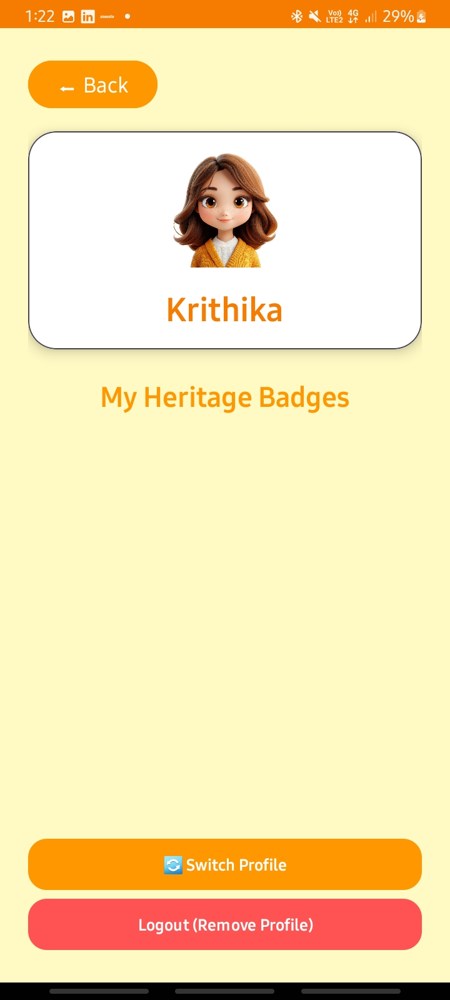
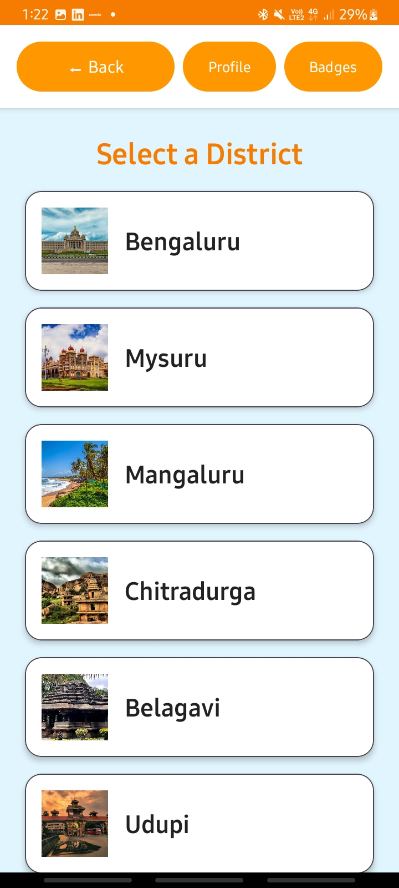
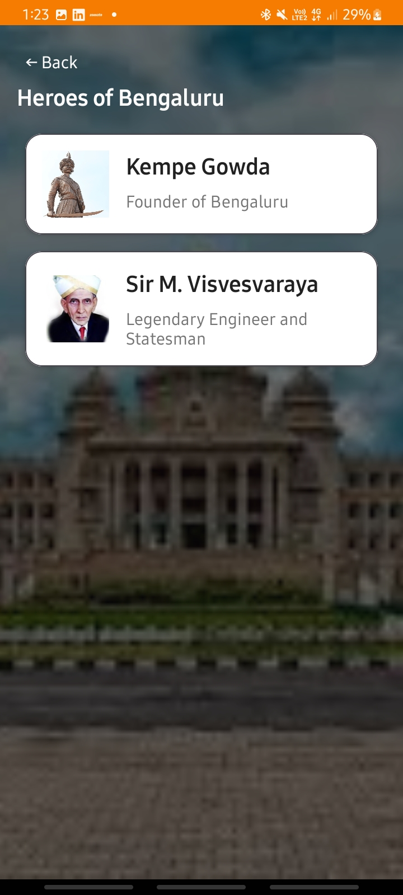
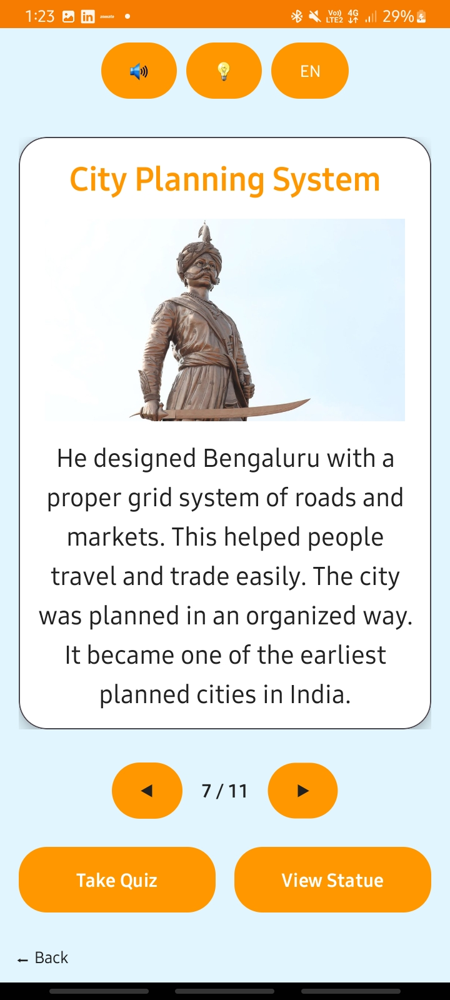
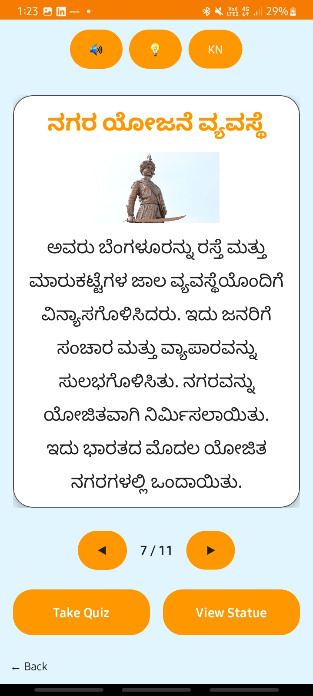
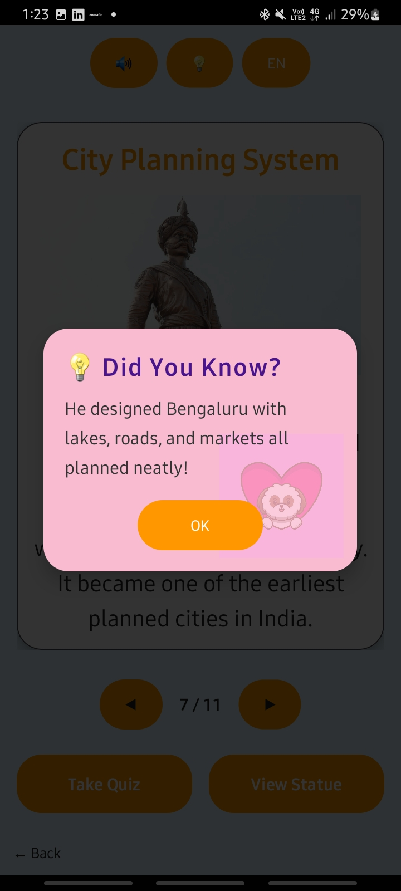
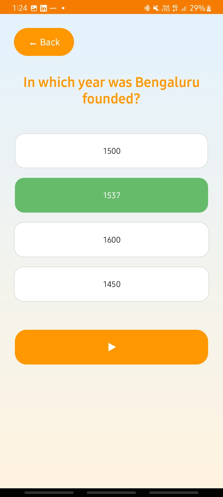
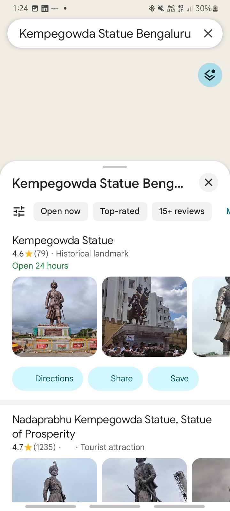

# Namma-Kathey

Namma-Kathey is an interactive storytelling Android application developed using Kotlin and Android Studio. The application is designed to help users learn about Karnataka’s local heroes in an engaging and educational way through interactive storytelling. It includes features such as multilingual support in Kannada and English, swipe-based story navigation, text-to-speech narration, quizzes, badge achievements, interesting fact popups, and Google Maps integration for viewing hero statue locations. The application aims to make learning more interactive, fun, and accessible for students and children while promoting awareness about Karnataka’s cultural heritage and inspiring personalities.

## Features
- Interactive hero storytelling
- Kannada and English language support
- Quiz and badge system
- Text-To-Speech narration
- Google Maps statue location feature
- Child-friendly UI design
- Swipe-based story pages using ViewPager2

## Technologies Used
- Kotlin
- Android Studio
- XML Layouts
- ViewPager2
- SharedPreferences
- JSON Data Handling
- Google Maps API
- Android Text-To-Speech API

## Application Screenshots

### Profile Creation Screen

### Home Screen

### Hero Listing Screen

### Story Screen

### Did You Know Popup

### Quiz Screen

### Statue Location using Google Maps

## Project Objective
The main objective of the project is to create an educational and interactive Android application that introduces users to Karnataka’s local heroes through storytelling, quizzes, multilingual support, and engaging learning features.

## Developed By
Krithika Devadiga

## Internship Company
MindMatrix
